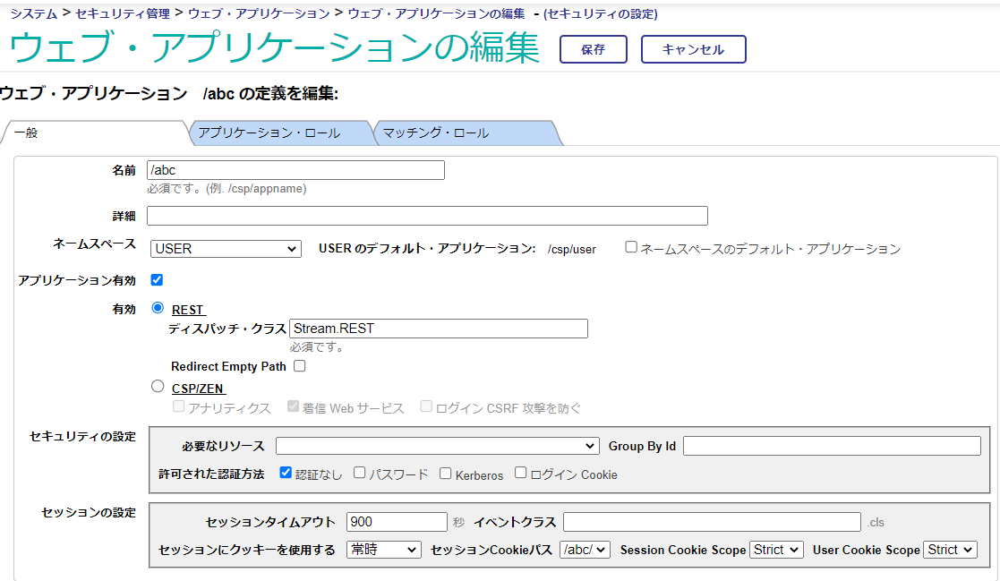

# 画像ファイルをPOSTする例

IRISにRESTディスパッチクラスを用意し、画像ファイルをPOSTした場合のHTTP要求の受け取り方を解説します。

《ご参考情報》

- IRISで作成するRESTサーバの仕組みについて

    [【はじめてのInterSystems IRIS】セルフラーニングビデオ：アクセス編：IRIS で作成する REST サーバの仕組み](https://jp.community.intersystems.com/node/479546)

- RESTディスパッチクラスの作成方法について

    [【はじめてのInterSystems IRIS】セルフラーニングビデオ：アクセス編：（REST）手動で作成するディスパッチクラス](https://jp.community.intersystems.com/node/479551)

- ObjectScriptの記述のヒントついて

    [ObjectScript クックブック](https://jp.community.intersystems.com/node/531611)をご参照ください。

___
## 1) 準備

任意のネームスペースに[Stream.REST.cls](./src/Stream/REST.cls)をインポートします。

- VSCodeの場合
IRISに接続し、Ctrl＋Sで保存＋インポートを実施します。

- Studioの場合
[Stream.REST.cls](./src/Stream/REST.cls)を対象ネームスペースに接続したスタジオにドラッグ＆ドロップでインポートします。

- 管理ポータルの場合
システムエクスプローラ > クラス > 左画面でネームスペース選択 > インポートボタンクリック > [Stream.REST.cls](./src/Stream/REST.cls)を指定してインポートします。

インポート後、管理ポータルで新しいウェブアプリケーションパスを作成し、"RESTディスパッチクラス"欄に「Stream.REST」を指定します。

**管理ポータル > システム管理 > セキュリティ > アプリケーション > ウェブ・アプリケーション > [新しいウェブ・アプリケーションを作成]ボタンクリック**


上の図例は、**パス：/abc**にRESTディスパッチクラスを指定し、**許可された認証方法**に「認証なし」を設定しています。

> IRIS for Healthの場合、デフォルトで認証なしアクセス用ユーザ（UnknownUser）には適切なロールが割り当てられていないため、RESTディスパッチクラスにアクセスできません。テスト的に試す場合は、アプリケーション・ロールに必要なロール（例では%All）を付与することで、設定したパス（例では/abc）通過時に指定したロールがユーザに付与されます。


## 2) RESTディスパッチクラスのコード解説

[Stream.REST.cls](./src/Stream/REST.cls)では、パスに **/abc/image** を指定してPOST要求を実行すると、**SaveImage()** メソッドが動作するように、UrlMapが定義されています。

例）
```
XData UrlMap [ XMLNamespace = "http://www.intersystems.com/urlmap" ]
{
<Routes>
<Route Url="/image" Method="POST" Call="SaveImage"/>
</Routes>
}
```
**SaveImage()** メソッドでは、送付されたファイルの中身（ストリーム）をコピーし、**c:\temp\post-imagetest1.png**に保存するように記述しています。

そのため、ファイルバイナリストリームのインスタンスを生成し **LinkToFile()** メソッドで保存時のファイル名をフルパスで指定しています。

```
set savename="c:\temp\post-imagetest1.png"
set bin=##class(%Stream.FileBinary).%New()
do bin.LinkToFile(savename)   
```

POST要求時のHTTP要求は、**%request**変数を使用して取得できます。

>この変数には、[%CSP.Request](https://docs.intersystems.com/irisforhealthlatest/csp/documatic/%25CSP.Documatic.cls?LIBRARY=%25SYS&CLASSNAME=%25CSP.Request)のインスタンスが設定されます。

取得方法は、POST要求時の送付方法により異なるため、以下の２つの方法で試せるように記述しています。

### 1) フォームデータとして画像が渡る場合

マルチパートのHTTP要求として処理します。
送付時のファイルに関連したフォーム名がわかる場合は、**GetMimeData("フォーム名")** でファイルの中身をストリームとして取得できます。

不明な場合は、順番にフォーム名を取得する方法があり、**NextMimeData("")** メソッドを使用します（引数が空の場合は最初のMimeDataのフォーム名を戻り値で取得できます）。

以下例は、フォーム名が不明な場合を試しています。

最初に発見したMimeDataのフォーム名を使用してMimeDataのストリームを取得し、ファイル保存用バイナリストリーム（変数bin）にコピーしています。

コピーには、**CopyFrom()**メソッドを使用しています。

ストリームの操作についてはドキュメント[ストリーム・インタフェースの使用法](https://docs.intersystems.com/irisforhealthlatestj/csp/docbook/DocBook.UI.Page.cls?KEY=GOBJ_propstream#GOBJ_propstream_interface)にも記載があります。ご参照ください。

```
set mimedata = %request.NextMimeData("")
do bin.CopyFrom(%request.GetMimeData(mimedata))
```

### 2) メッセージのBody全体をファイルとして送付する場合

フォーム名を指定して送付していないため [1) フォームデータとして画像が渡る場合](#1-フォームデータとして画像が渡る場合)の中で設定する変数 mimedata は取得できず、空（""）が設定されます。

サンプルでは、mimedata変数が空の場合Body全体をファイルとして送付している状態と考え **%request.Content** を使用して送付されたストリームを取得しています。

```
if $get(mimedata)="" {
    do bin.CopyFrom(%request.Content)
}
```
1),2)共通で、最後にバイナリファイルを保存しています。ファイル保存時エラーステータスが戻る場合は、例外を生成し、CATCHへスローしています。

```
//ファイル保存
$$$ThrowOnError(status=bin.%Save())
```

保存が成功した場合、HTTP応答のJSONを作成し出力（**%ToJSON()** を実行）して終了です。
```
set result={}
set result.Message=savename_"に保存しました"
set result.Status=status
do result.%ToJSON()
```


## 3) テスト実行

curlコマンドを使ってテストします。送付するファイルは[imagetest1.png](/imagetest1.png)を使用しています。（指定するファイルのパスは適宜変更してください。）

フォームデータの一部にファイルを含めて送付する場合は以下の通りです。
```
curl -X POST http://localhost:52773/abc/image -F file1=@C:\WorkSpace\StreamTest\imagetest1.png
```

Body全体がファイルの場合は、以下の通りです。
```
curl -X POST http://localhost:52773/abc/image -H "Content-Type:image/png" --data-binary @C:\WorkSpace\StreamTest\imagetest1.png
```

正常に実行できると以下のJSONがHTTP応答として返ります。
```
{"Message":"c:\\temp\\post-imagetest1.pngに保存しました","Status":1}
```
